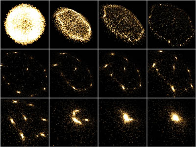
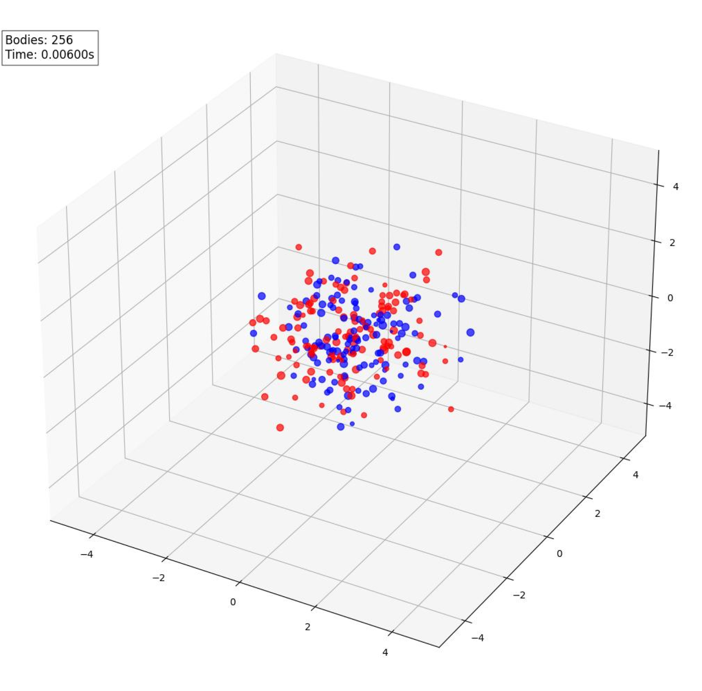
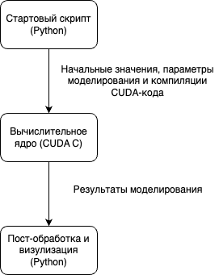
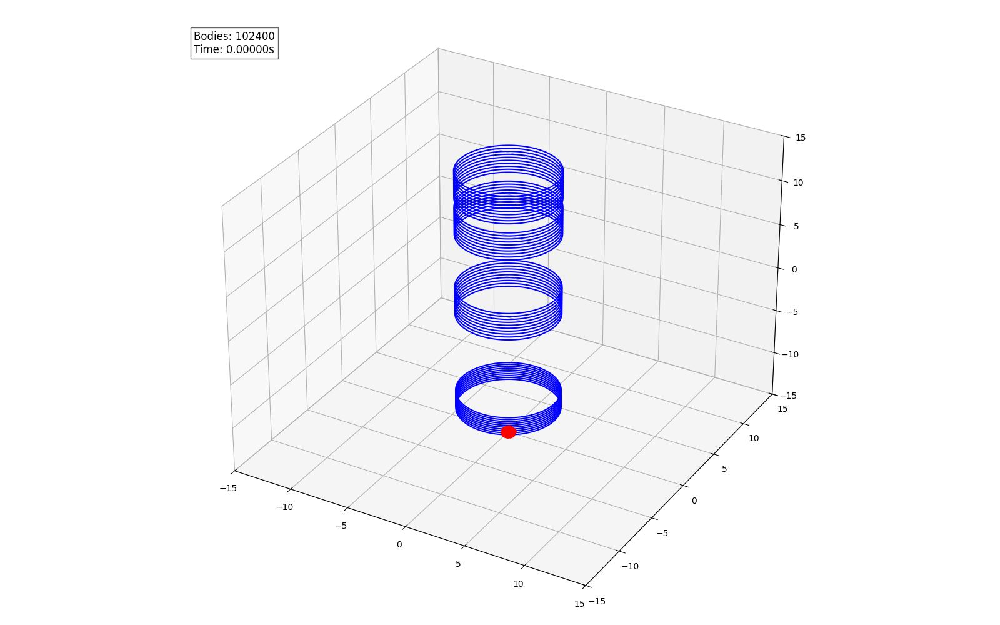
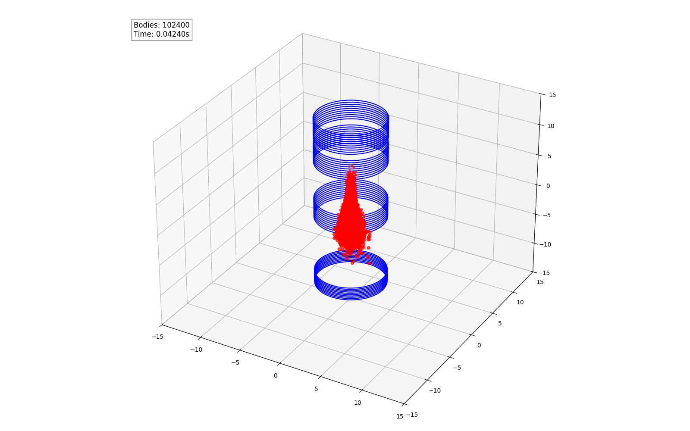
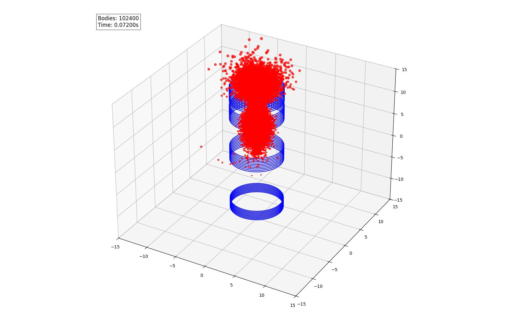
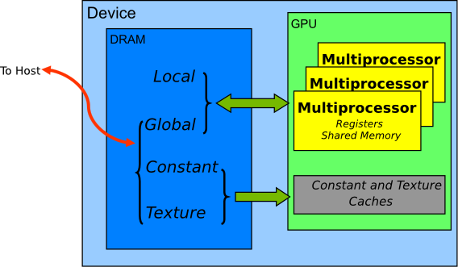

---
## Front matter
title: "Моделирование движения пучка в электромагнитном поле с помощью GPU"
author: "Кадров Виктор Максимович"

## Generic otions
lang: ru-RU
toc-title: "Содержание"

## Bibliography
bibliography: bib/cite.bib
csl: pandoc/csl/gost-r-7-0-5-2008-numeric.csl

## Pdf output format
toc: true # Table of contents
toc-depth: 2
lof: true # List of figures
lot: true # List of tables
fontsize: 12pt
linestretch: 1.5
papersize: a4
documentclass: scrreprt
## I18n polyglossia
polyglossia-lang:
  name: russian
  options:
	- spelling=modern
	- babelshorthands=true
polyglossia-otherlangs:
  name: english
## I18n babel
babel-lang: russian
babel-otherlangs: english
## Fonts
mainfont: IBM Plex Serif
romanfont: IBM Plex Serif
sansfont: IBM Plex Sans
monofont: IBM Plex Mono
mathfont: STIX Two Math
mainfontoptions: Ligatures=Common,Ligatures=TeX,Scale=0.94
romanfontoptions: Ligatures=Common,Ligatures=TeX,Scale=0.94
sansfontoptions: Ligatures=Common,Ligatures=TeX,Scale=MatchLowercase,Scale=0.94
monofontoptions: Scale=MatchLowercase,Scale=0.94,FakeStretch=0.9
mathfontoptions:
## Biblatex
biblatex: true
biblio-style: "gost-numeric"
biblatexoptions:
  - parentracker=true
  - backend=biber
  - hyperref=auto
  - language=auto
  - autolang=other*
  - citestyle=gost-numeric
## Pandoc-crossref LaTeX customization
figureTitle: "Рис."
tableTitle: "Таблица"
listingTitle: "Листинг"
lofTitle: "Список иллюстраций"
lotTitle: "Список таблиц"
lolTitle: "Листинги"
## Misc options
indent: true
header-includes:
  - \usepackage{indentfirst}
  - \usepackage{float} # keep figures where there are in the text
  - \floatplacement{figure}{H} # keep figures where there are in the text
---

# Введение

В докладе рассматривается подход к моделированию взаимодействия заряженных частиц в пучке. В качестве отправной точки анализируется задача с гравитационным взаимодействием (рис. [-@fig:001]), поскольку она во многом аналогична электрической, но проще для понимания на первом этапе.
$$
\left\{
\begin{aligned}
& \dot{\vec{v}}_{i}= G\sum_{j \neq i} \frac{m_j}{||\vec{r}||^3} \vec{r} , \\
& \dot{\vec{x}}_{i} = \vec{v}_{i}, \\
& \vec{x}_{i}(0) = \vec{x}_0, \vec{v}_{i}(0) = \vec{v}_{0},\\
\end{aligned}
\right.
$$
где $\vec{r} = \vec r_i - \vec r_j$ -- радиус-вектор между телами

{#fig:001 width=100%}

Известно, что даже задача трёх тел в гравитационном взаимодействии не имеет общего аналитического решения, и при увеличении числа тел (N-тел) задача усложняется ещё больше. Однако уже на этом уровне можно выделить два важных аспекта:

1. Наличие члена, обратного к расстоянию в третьей степени, приводит к численным сложностям при моделировании близких взаимодействий.
2. С увеличением числа тел индивидуальные траектории теряют значение, уступая место коллективной динамике всей системы — в данном случае, пучка частиц.

# Замена гравитационного взаимодействия на электрическое

Поскольку в задаче рассматриваются заряженные частицы, гравитационное взаимодействие заменяется на кулоновское. 

$$
\begin{aligned}
& \dot{\vec{v}}_{i}= \frac{1}{4\pi\epsilon_0m_i}\sum_{j \neq i} \frac{q_i q_j}{||\vec{r}||^3} \vec{r} . \\
\end{aligned}
$$

Обозначим теперь $\frac{1}{4\pi\epsilon_0}\sum_{j \neq i} \frac{q_j}{||\vec{r}||^3} \vec{r}$ как $\vec E_s$. Добавим внешнее электрическое ($\vec{E_{ext}}$) и магнитное ($\vec{B}_{ext}$) поле  и получим
$$
\begin{aligned}
& \dot{\vec{v}}_{i}= \frac{q_i}{m_i}(\vec{E}_{s} + \vec E_{ext} +[\vec{v_i}, \vec{B}_{ext}]). \\
\end{aligned}
$$

# Постановка задачи

Таким образом, формулируется следующая задача Коши: заданы начальные положения и скорости частиц, а также известно внешнее по отношению к пучку электромагнитное поле

$$
\left\{
\begin{aligned}
& \dot{\vec{v}}_{i}= \frac{q_i}{m_i}(\vec{E}_{s} + \vec E_{ext} +  [\vec{v_i}, \vec{B}_{ext}]), \\
& \dot{\vec{x}}_{i} = \vec{v}_{i}, \\
& \vec{x}_{i}(0) = \vec{x}_0, \vec{v}_{i}(0) = \vec{v}_{0},\\
\end{aligned}
\right.
$$

Следует отметить, что рассматривается нерелятивистская постановка задачи, и в таком виде она далее и решается.

# Численное решение уравнений движения

Уравнения движения решаются методом конечных разностей

$$
\vec x_{t + 1} = \vec x_t +  F(\vec x_t, \dots)\Delta t
$$

Особое внимание уделяется выбору численной схемы, поскольку на каждом шаге моделирования возникает множество взаимодействий, и даже незначительные численные ошибки могут существенно повлиять на результат.

В рамках тестирования применялась явная схема Эйлера, однако учитывались её ограничения.

Среди альтернативных схем рассматривается метод Бориса — численная схема второго порядка, обладающая временной обратимостью. Однако он вносит в систему дополнительные силы, отсутствующие в исходной физической постановке, и на релятивистских скоростях эти силы становятся заметными и искажают результат [@vay2008].

# Трудности в расчёте собственного поля

Наибольшие сложности связаны не с решением уравнений движения, а с вычислением собственного поля пучка. Прямое моделирование взаимодействий по схеме "каждый с каждым" (Particle-to-Particle) требует вычислительных затрат порядка $\mathcal{O}(N^2)$, что делает этот подход непрактичным даже при относительно малом числе частиц. Для иллюстрации на рис. [-@fig:002] изображена система из 256 частиц, но в реальных задачах их число может достигать $10^{15}$.

{#fig:002 width=100%}

# Метод крупных частиц

Одним из способов снижения вычислительной сложности является объединение множества частиц в макрочастицы (Метод крупных частиц).

Для каждой $i$-й макрочастицы пару
$$
(\vec r_i, \vec v_i)
$$ 
можно взять, например, как среднее по микрочастицам.

Тогда, взяв макрочастицу как облако с радиусом $R$ поле вычисляется как
$$
\vec E_s (j \rightarrow i) = \frac{1}{4\pi\epsilon_0}\frac{q_j}{R^3}\vec r,\quad ||\vec r|| < R
$$

Кроме того, этот подход позволяет смягчить проблему моделирования близких взаимодействий, так как взаимодействие происходит только при пересечении облаков, то есть когда расстояние между ними меньше $R$. Это позволяет сократить число взаимодействий с $10^{15}$ до, например, $10^9$, что всё ещё является вычислительно затратным. Поэтому на практике чаще применяется другой метод — Particle-In-Cell (PIC).

# Метод Particle-In-Cell

Метод PIC исключает необходимость моделирования парных взаимодействий. Вместо этого рассчитывается распределение заряда на сетке (рис. [-@fig:003]), и далее решается краевая задача для уравнения Пуассона с целью нахождения электрического поля.

{#fig:003 width=100%}

Именно этот метод чаще всего используется в прикладных задачах. 

# Ускорение расчётов с использованием графических процессоров

Даже при использовании макрочастиц и метода PIC последовательное решение задачи остаётся неприемлемо медленным. Поэтому в современных вычислениях активно применяются графические ускорители (GPU). Они позволяют эффективно распараллелить как решение уравнений движения, так и вычисление собственного поля пучка.

Среди готовых  решений:

1. [https://github.com/GabrielSCabrera/nBody](https://github.com/GabrielSCabrera/nBody) — предназначен для моделирования задачи N-тел с электрическим взаимодействием. Подходит скорее для учебных целей, но демонстрирует общий подход.
2. [https://developer.nvidia.com/gpugems/gpugems3/part-v-physics-simulation/chapter-31-fast-n-body-simulation-cuda](https://developer.nvidia.com/gpugems/gpugems3/part-v-physics-simulation/chapter-31-fast-n-body-simulation-cuda) — ориентирован на гравитационные взаимодействия, но полезен с точки зрения изучения архитектуры GPU.
3. [https://developer.nvidia.com/gpugems/gpugems3/part-v-physics-simulation/chapter-31-fast-n-body-simulation-cuda](https://developer.nvidia.com/gpugems/gpugems3/part-v-physics-simulation/chapter-31-fast-n-body-simulation-cuda) — разрабатывается в CERN для задач ускорительной физики. Хотя пакет слабо поддерживается, его структура может оказаться полезной для ряда задач.

# Архитектура собственной реализации

В рамках практической части проекта была разработана архитектура (рис. [-@fig:004]), сочетающая удобство настройки с возможностью высокопроизводительных вычислений. Python-обвязка обеспечивает гибкость при задании начальных условий и параметров моделирования. Хотя подобные задачи можно реализовывать и средствами CUDA на C/C++, использование Python значительно упрощает отладку и запуск, особенно при работе на вычислительных кластерах.

{#fig:004 width=100%}

# Результаты моделирования
Реализация позволяет моделировать динамику пучка заряженных частиц в электромагнитном поле. Легко моделируются пучки до 200 тыс. частиц и приемлемо -- до 500 тыс.

{#fig:005 width=100%}

{#fig:006 width=100%}

{#fig:007 width=100%}

# Дальнейшая работа

Отдельной задачей остаётся учёт геометрии экспериментальной установки. Даже при её упрощении и грубой дискретизации проблема столкновений частиц становится вычислительно трудоёмкой, особенно при прямом переборе всех возможных пар.

Наконец, важным аспектом является правильное использование различных уровней памяти в архитектуре видеокарт NVIDIA. На  рис. [-@fig:008] приведена иерархия памяти GPU [@IntroductionCUDA], практически все типы которой доступны пользователю. От выбора типа памяти напрямую зависит производительность: при неправильной организации данных ускорение может быть полностью нивелировано.

{#fig:008 width=100%} 

# Заключение

Рассмотренная задача моделирования пучков заряженных частиц в электромагнитных полях требует комплексного подхода, сочетающего точные численные методы, эффективную архитектуру программного обеспечения и использование современных вычислительных ресурсов. Несмотря на ряд нерешённых проблем, разработанная архитектура демонстрирует потенциал для дальнейшего развития и внедрения в более сложные модели, включая учёт геометрии установки и использование PIC-методов.

# Список литературы{.unnumbered}

::: {#refs}
:::
