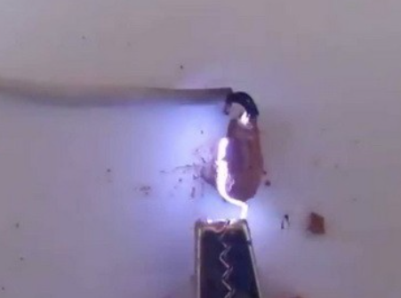
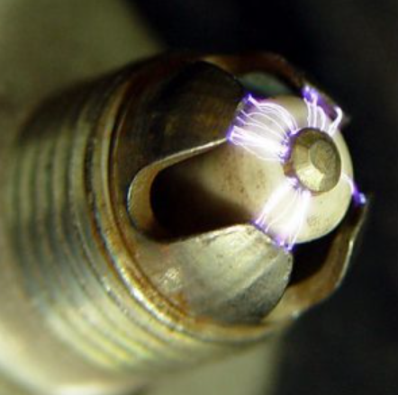
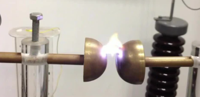
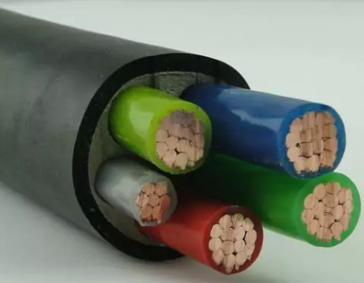

---
## Front matter
title: "Проект: Электрический пробой "
subtitle: "Этап 1"
author: 
      - Tуем Гислен 
      - Кадров Виктор Максимович
      - Адабор Кристофер

## Generic otions
lang: ru-RU
toc-title: "Содержание"

## Bibliography
bibliography: bib/cite.bib
csl: pandoc/csl/gost-r-7-0-5-2008-numeric.csl

## Pdf output format
toc: true # Table of contents
toc-depth: 2
lof: true # List of figures
lot: true # List of tables
fontsize: 12pt
linestretch: 1.5
papersize: a4
documentclass: scrreprt
## I18n polyglossia
polyglossia-lang:
  name: russian
  options:
	- spelling=modern
	- babelshorthands=true
polyglossia-otherlangs:
  name: english
## I18n babel
babel-lang: russian
babel-otherlangs: english
## Fonts
mainfont: IBM Plex Serif
romanfont: IBM Plex Serif
sansfont: IBM Plex Sans
monofont: IBM Plex Mono
mathfont: STIX Two Math
mainfontoptions: Ligatures=Common,Ligatures=TeX,Scale=0.94
romanfontoptions: Ligatures=Common,Ligatures=TeX,Scale=0.94
sansfontoptions: Ligatures=Common,Ligatures=TeX,Scale=MatchLowercase,Scale=0.94
monofontoptions: Scale=MatchLowercase,Scale=0.94,FakeStretch=0.9
mathfontoptions:
## Biblatex
biblatex: true
biblio-style: "gost-numeric"
biblatexoptions:
  - parentracker=true
  - backend=biber
  - hyperref=auto
  - language=auto
  - autolang=other*
  - citestyle=gost-numeric
## Pandoc-crossref LaTeX customization
figureTitle: "Рис."
tableTitle: "Таблица"
listingTitle: "Листинг"
lofTitle: "Список иллюстраций"
lotTitle: "Список таблиц"
lolTitle: "Листинги"
## Misc options
indent: true
header-includes:
  - \usepackage{indentfirst}
  - \usepackage{float} # keep figures where there are in the text
  - \floatplacement{figure}{H} # keep figures where there are in the text
---

# Цель работы

Цель проекта — исследовать явление электрического пробоя, изучить его физические основы, разработать модель для анализа возникновения пробоя

## Этап 1:  Определение и основы электрического пробоя

### Цель

Дать точное определение электрического пробоя и изложить его основные понятия, чтобы установить четкую терминологию и основу для дальнейшего исследования.

# Задание

- Формальное определение электрического пробоя
- Объяснение понятий электрической изоляции и диэлектриков
- Определение и важность диэлектрической прочности
- Введение понятия критической напряженности электрического поля

# Теоретическое введение

Электрический пробой – это явление резкого возрастания электрического тока через диэлектрик, сопровождающееся потерей его изолирующих свойств. Другими словами, это переход материала из изолирующего состояния в проводящее под воздействием сильного электрического поля.(рис. [-@fig:001]).

{#fig:001 width=70%}

Процесс разрушения диэлектрика, наступающий в ходе ударной ионизации электронами вследствие разрыва межатомных, межмолекулярных или межионных связей, называется электрическим пробоем. Продолжительность электрического пробоя по времени лежит в диапазоне от единиц наносекунд до десятков микросекунд.

В зависимости от обстоятельств возникновения, электрический пробой может быть вредным или полезным. Пример полезного электрического пробоя — разряд на свече зажигания в рабочей зоне цилиндра двигателя внутреннего сгорания. Пример вредного пробоя — пробой изолятора на ЛЭП.(рис. [-@fig:002]).

{#fig:002 width=70%}

# Выполнение работы
## Определение электрического пробоя

Электрический пробой – это явление, которое происходит, когда диэлектрический материал (изолятор) подвергается воздействию электрического поля, достаточно сильного, чтобы его изоляционные свойства были резко нарушены. Эта потеря изоляции проявляется в внезапном и значительном увеличении электропроводности, позволяющем току протекать через материал, который затем становится проводником. Пробой часто сопровождается видимым разрядом (искрой, электрической дугой) и может привести к необратимому повреждению материала.(рис. [-@fig:003]).

{#fig:003 width=70%}

## Электрическая изоляция и диэлектрики
Диэлектрики – это непроводящие материалы (изоляторы), используемые для хранения электрической энергии в виде электрического поля. Они поляризуются в присутствии электрического поля, то есть их молекулы выстраиваются в соответствии с полем, но не позволяют свободного перемещения электронов [@KakRabotaetElektricheskaya]. Диэлектрики необходимы в конденсаторах, кабелях, трансформаторах и многих других электрических устройствах. Примеры диэлектриков: воздух, бумага, пластик, стекло, керамика, масло, изоляция проводов (рис. [-@fig:004]).

{#fig:004 width=70%}

## Диэлектрическая проницаемость

Диэлектрическая прочность (также называемая диэлектрической стойкостью или сопротивлением диэлектриков) – это собственное свойство диэлектрического материала, которое количественно определяет его способность выдерживать электрическое поле, прежде чем произойдет пробой. Она определяется как максимальное значение напряженности электрического поля (измеряется в вольтах на метр (В/м), вольтах на миллиметр (В/мм) или киловольтах на сантиметр (кВ/см)), которое материал может выдержать без потери своих изоляционных свойств. Высокая диэлектрическая прочность указывает на то, что материал может выдерживать более интенсивные электрические поля, прежде чем произойдет пробой. Диэлектрическая прочность является критическим параметром при проектировании электрооборудования, поскольку она определяет максимальное напряжение, которое изолятор может выдержать безопасным образом.

## Критическая напряженность электрического поля

Критическая напряженность электрического поля ($E_c$) – это значение напряженности электрического поля, при котором происходит электрический пробой. Она тесно связана с диэлектрической прочностью. Когда электрическое поле, приложенное к диэлектрику, достигает или превышает критическую напряженность электрического поля, силы, действующие на электроны в материале, становятся достаточно сильными, чтобы вызвать ионизацию, электронную лавину или другие явления, которые приводят к разрушению изоляции. Критическая напряженность электрического поля зависит от свойств материала, его температуры, давления окружающей среды и частоты приложенного поля. Понимание и контроль критической напряженности электрического поля необходимы для предотвращения пробоя и обеспечения надежности электрических систем.

## Процесс пробоя в диэлектрике

Возникновение искрового электрического разряда сильно зависит от условий эксперимента. В длинных искровых промежутках (когда расстояние между электродами составляет десятки сантиметров или даже метры) при постепенном увеличении напряжения между электродами вначале наблюдается коронный разряд.

При напряжениях, более высоких, чем те, которые приводят к образованию короны, в газах возникают так называемые стримеры. Стримеры представляют собой систему слабосветящихся проводящих каналов, образующуюся в газе в области наиболее сильного электрического поля. Стример прорастает, как правило, с одного из электродов и привысоких напряжениях может ветвиться. Ветвление стримера происходит нерегулярно, и на сегодняшний день можно считать, что эти ветвления носят случайных характер. [@medvedev]

# Модель

## Вычисление электрического потенциала

По теореме Гаусса поток вектора индукции электрического поля $D$ через любую замкнутую поверхность $S$ равен нулю при отсутствии внутри поверхности свободных электрических зарядов
$$
\oint_S \mathbf{D} \cdot \mathbf{n} ds = 0
$$
Для большинства диэлектриков индукция электрического поля выражается через электрическое поле как $D = \epsilon E$.

Рассмотрим сетку с шагом $\Delta x$, $\Delta y$ и $\Delta z$. Пусть электрический потенциал принимает в центре i-той ячейки значение $\varphi_{i,j,k}$.

Тогда проекция электрического поля на ось $x$ на левой и правой грани ячейки будет приблеженно равно 
$$
E_x(x) \approx -\frac{\varphi_{i,j,k} - \varphi_{i-1,j,k}}{h}, \quad
E_x(x + \Delta x) \approx -\frac{\varphi_{i+1,j,k} - \varphi_{i,j,k}}{h}
$$
соответсвенно.

Поток вектора индукции электрического поля изнутри ячейки через эти две грани будет равен
$$
\Phi_x = \varepsilon E_x(x + \Delta x) h^2 - \varepsilon E_x(x) h^2 = -\varepsilon \left(\varphi_{i+1,j,k} - 2\varphi_{i,j,k} + \varphi_{i-1,j,k} \right) h.
$$
Аналогично поток считается и для остальных граней. Просуммируем поток по всем граням и, принимая равенство нулю полного потока получим для двумерного случая
$$
\varphi_{i,j} = \frac{1}{4}(\varphi_{i - 1,j} + \varphi_{i + 1,j} + \varphi_{i,j - 1} + \varphi_{i,j+1})
$$
значение потенциала в каждом узле.

## Модель Нимейера, Пьетронеро и Висмана
Модель позволяет описать рост структур разряда в диэлектриках. В основе модели лежит предположение, что структура растет случайным образом, причем вероятность роста зависит только от локального электрического поля вблизи структуры. Обычно моделируется разряд в диэлектрике, помещенном между двумя электродами, разность потенциалов между которыми $V$.
Рост начинается с одной из точек на электроде.На каждом шаге роста с некоторой вероятностью может образоваться одна веточка разрядной структуры. Эта веточка будет соединять два соседних узла сетки, один из которых уже принадлежит разрядной структуре, а другой является «диэлектриком». Таким образом, из каждого узла двумерной сетки может образоваться до восьми веточек, если учитывать возможность роста и по диагоналям (для трехмерной сетки до 26 веточек). Пусть $E$ — среднее значение проекции электрического поля на направление, соединяющего два соседних узла сетки, между которыми может образоваться новая ветвь разрядной структуры. Обычно предполагают, что вероятность ее образования приближенно равна $p(E) \sim E^{\eta}$, где $\eta$ — так называемый показатель роста, зависящий только от свойств диэлектрика. Структура разряда растет до тех пор, пока не достигнет противоположного
электрода.

# Выводы
На этом первом этапе было дано точное и полное определение электрического пробоя, выделены основные понятия электрической изоляции, диэлектрика, стримеров, дано описание модели. Эти определения и понятия послужат основой для следующих этапов проекта.

# Список литературы{.unnumbered}

::: {#refs}
:::

