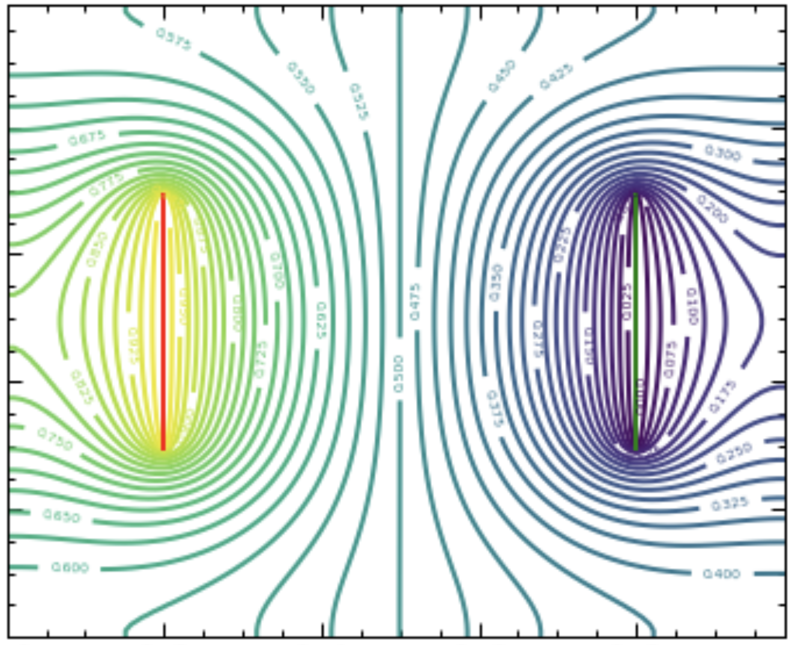

---
## Front matter
lang: ru-RU
title: "Проект: Электрический пробой"
subtitle: Этап 2
author:
  - Кадров В. М.
  - Tуем Г.
  - Адабор К.
institute:
  - Российский университет дружбы народов, Москва, Россия
  

## i18n babel
babel-lang: russian
babel-otherlangs: english

## Formatting pdf
toc: false
toc-title: Содержание
slide_level: 2
aspectratio: 169
section-titles: true
theme: metropolis
header-includes:
 - \metroset{progressbar=frametitle,sectionpage=progressbar,numbering=fraction}
---

## Постановка задачи

**Цель**: Необходимо разработать алгоритм для решения задачи моделирования электрического пробоя (модель  Нимейера, Пьетронеро и Висмана). Всего мы имеем 2 этапа моделирования:

* Расчет электрического поля
* Итерационное моделирования роста стримера (главной ветви заряда)

---

## Расчет электрического поля

Поскольку задача расчета поля сводится (см. Этап 1) к решению уравнения Лапласа
$$
\nabla^{2} \varphi = 0
$$
то мы можем использовать аппроксимацию электрического потенциала на сетке
$$
\varphi_{i,j} = \frac{1}{4}(\varphi_{i - 1,j} + \varphi_{i + 1,j} + \varphi_{i,j - 1} + \varphi_{i,j+1})
$$
## Численное решение
Таким образом, для решения этого уравнения методом конечных разностей нам необохдимо:
1. Разбить сетку с шагом $\Delta$
2. Задать граничные условия
3. Расчитывать $\varphi_{i,j}$ в каждом узле. 
4. Повторять пункт 3 до достижения сходимости

## Сетка 

Часто рассматривается система, состоящая из двух горизонтальных плоских электродов, пространство между которыми заполнено диэлектриком. Удобно задать потенциал одного из электродов равным нулю. Тогда потенциал второго электрода равен приложенному напряжению. Для простоты можно рассматривать задачу в прямоугольной области,
ограниченной сверху и снизу электродами, а слева и справа — вертикальными границами, на которых тоже необходимо задать граничные условия.

## Сетка

{#fig:001 width=70%}

## Модель роста стримера

Рост начинается с одной из точек на электроде. На каждом шаге роста с некоторой вероятностью может образоваться одна веточка разрядной структуры. Эта веточка будет соединять два соседних узла сетки, один из которых уже принадлежит разрядной структуре, а другой является «диэлектриком».

## Модель роста стримера

Удобно рассматривать рост структуры с электрода, имеющего нулевой потенциал.

Обычно предполагают, что вероятность образования новой ветки приближенно равна $p(E) \sim E^{\eta}$, где $\eta$ — так называемый показатель роста, зависящий только от свойств диэлектрика.
## Модель роста стримера

На каждом шаге роста случайный процесс выбора новой веточки структуры реализуется следующим алгоритмом:  

1. Для каждого возможного направления роста считается сумма $Z = \sum_{k=1}^{M} E_k^{\eta}$
2. Случайным образом выбирается число $\epsilon$ от 0 до Z
3. Затем повторно шаг за шагом рассчитывается сумма Z до тех пор, пока текущая сумма не станет больше $\epsilon$. Тот узел, для которого сумма стала больше $\epsilon$, присоединяется к структуре.
4. Новой образовавшейся веточке присваивается значение потенциала того электрода, с которого начался рост этого стримера.
5. Алгоритм повторяется до тех пор, пока стример не дойдет до второго электрода.

Таким образом, мы получаем однозвенную структуру стримера.

# Заключение

Был подготовлен алгоритм для решения задачи моделирования пробоя в диэлектрике.

 