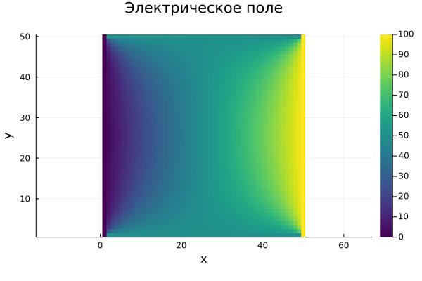
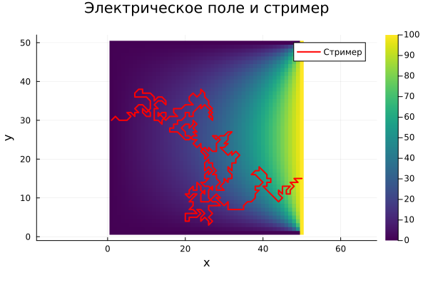
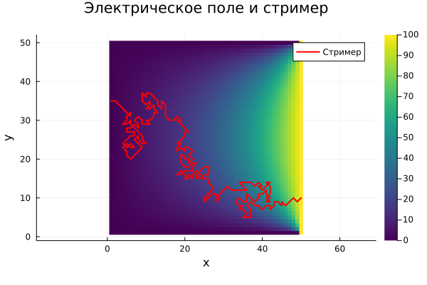
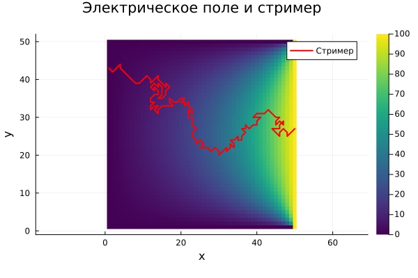

---
## Front matter
lang: ru-RU
title: "Проект: Электрический пробой"
subtitle: Этап 3, программная реализация
author:
  - Кадров В. М.
  - Tуем Г.
  - Адабор К.
institute:
  - Российский университет дружбы народов, Москва, Россия
  

## i18n babel
babel-lang: russian
babel-otherlangs: english

## Formatting pdf
toc: false
toc-title: Содержание
slide_level: 2
aspectratio: 169
section-titles: true
theme: metropolis
header-includes:
 - \metroset{progressbar=frametitle,sectionpage=progressbar,numbering=fraction}
---

## Цель

Необходимо написать программную реализацию решения задачи моделирования электрического пробоя на языке Julia.

---

## Задание начальных условий
 
Задаем начальные условия для расчета электрического поля: сетка 50x50, два электрода:

* К правому приложено напряжение
* На левом потенциал равен нуля, как на других границах
* Начальные значения в узлах сетки также равны нулю

```julia
# Параметры и начальные условия
rows, cols = 50, 50
field = fill(0.0, rows, cols)
field[:, 1] .= 0.0     # левый электрод
field[:, end] .= 100.0 # правый электрод
```

## Расчет электрического поля (решение уравнения Лапласа)
Итерации в цикле останавливаются, если мы достигли сходимости, либо же если количество итераций превысило максимум (max_iter).
```julia
# Решение уравнения Лапласа
function solve_field(field; max_iter=10000, tol=1e-6)
    rows, cols = size(field)
    new_field = copy(field)
    # Основной цикл итераций
    for _ in 1:max_iter
        # Проходимся по всем узлам сетки
        for i in 2:rows-1, j in 2:cols-1
            new_field[i, j] = 0.25 * (field[i-1, j] + field[i+1, j] + field[i, j-1] + field[i, j+1])
        end
```

## Расчет электрического поля (решение уравнения Лапласа)

```julia
        if maximum(abs.(new_field - field)) < tol
            break
        end
        field, new_field = new_field, field
    end

    return field
end
```

## Расчет электрического поля (решение уравнения Лапласа)

{#fig:001 width=70%}

## Моделирование роста стримера

Расчитываем структуру стримера по модели НПВ (Нимейера, Пьетронеро и Висмана).

```julia
function grow_streamer(field, growth_factor=2.0, max_steps=10_000)
    rows, cols = size(field)
    path = [(rand(1:rows), 1)]
    # задаем максимальное количество шагов
    for _ in 1:max_steps
        curr = path[end]
        # Находим возможные направления роста
        neighbors = [(curr[1]+di, curr[2]+dj) for di in -1:1, dj in -1:1
                     if (di != 0 || dj != 0) &&
                        1 ≤ curr[1]+di ≤ rows &&
                        1 ≤ curr[2]+dj ≤ cols &&
                        !((curr[1]+di, curr[2]+dj) in path)]

        if isempty(neighbors)
            break
        end
```
## Моделирование роста стримера
```julia
        # Считаем сумму вероятностей и умножаем на случайное число 
        probs = [abs(field[i, j])^growth_factor for (i, j) in neighbors]
        total_prob = sum(probs)
        r = rand() * total_prob
        acc = 0.0
       
```

## Моделирование роста стримера
```julia       
        
        # Находим узел, в котором накопленная сумма превышает порог r
        for ((i, j), p) in zip(neighbors, probs)
            acc += p
            if acc > r
                push!(path, (i, j))
                break
            end
        end
        # Проверяем, не достигли ли мы противоположного электрода
        if path[end][2] == cols
            break
        end
    end
```

## Моделирование

Необходимо дополнительно задать фактор роста ($\eta$)и добавить визуализацию.

```julia
field = solve_field(field)
path = grow_streamer(field, 3.0)

# Визуализация
heatmap(field, aspect_ratio=1, title="Электрическое поле и стример", xlabel="x", ylabel="y", color=:viridis)
x, y = [i for (i, _) in path], [j for (_, j) in path]
plot!(y, x, color=:red, lw=2, label="Стример", legend=:topright)
```
## Моделирование
Попробуем запустить моделирования с разным фактором роста. При малом параметре роста структура получается достаточно запутанной.

{#fig:002 width=60%}

## Моделирование
{#fig:003 width=70%}

## Моделирование
Хорошо видно, что чем выше показатель роста, тем более прямолинейная получается структура стримера

{#fig:004 width=60%}

## Заключение

Была написана программная реализация решения задачи моделирования электрического пробоя на языке Julia.
