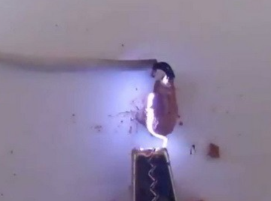
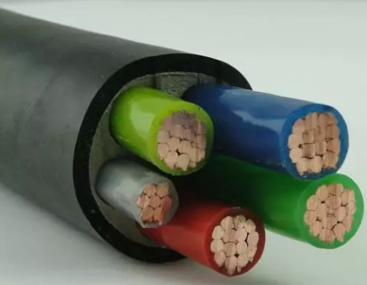
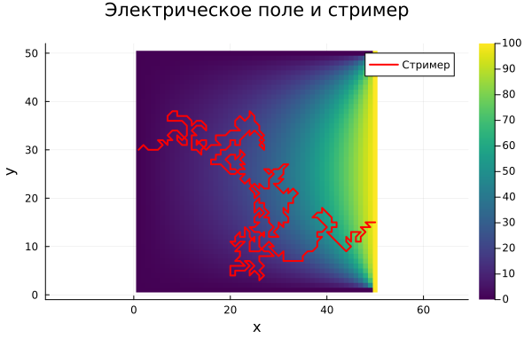
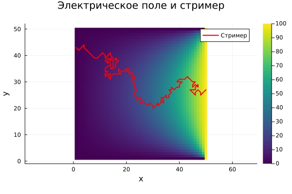

---
## Front matter
title: "Проект: Электрический пробой"
subtitle: "Этап 4. Защита проекта"
author:
  - Кадров В. М.
  - Tуем Г.
  - Адабор К. Т.


## Generic otions
lang: ru-RU
toc-title: "Содержание"

## Bibliography
bibliography: bib/cite.bib
csl: pandoc/csl/gost-r-7-0-5-2008-numeric.csl

## Pdf output format
toc: true # Table of contents
toc-depth: 2
lof: true # List of figures
lot: false # List of tables
fontsize: 12pt
linestretch: 1.5
papersize: a4
documentclass: scrreprt
## I18n polyglossia
polyglossia-lang:
  name: russian
  options:
	- spelling=modern
	- babelshorthands=true
polyglossia-otherlangs:
  name: english
## I18n babel
babel-lang: russian
babel-otherlangs: english
## Fonts
mainfont: IBM Plex Serif
romanfont: IBM Plex Serif
sansfont: IBM Plex Sans
monofont: IBM Plex Mono
mathfont: STIX Two Math
mainfontoptions: Ligatures=Common,Ligatures=TeX,Scale=0.94
romanfontoptions: Ligatures=Common,Ligatures=TeX,Scale=0.94
sansfontoptions: Ligatures=Common,Ligatures=TeX,Scale=MatchLowercase,Scale=0.94
monofontoptions: Scale=MatchLowercase,Scale=0.94,FakeStretch=0.9
mathfontoptions:
## Biblatex
biblatex: true
biblio-style: "gost-numeric"
biblatexoptions:
  - parentracker=true
  - backend=biber
  - hyperref=auto
  - language=auto
  - autolang=other*
  - citestyle=gost-numeric
## Pandoc-crossref LaTeX customization
figureTitle: "Рис."
tableTitle: "Таблица"
listingTitle: "Листинг"
lofTitle: "Список иллюстраций"
lotTitle: "Список таблиц"
lolTitle: "Листинги"
## Misc options
indent: true
header-includes:
  - \usepackage{indentfirst}
  - \usepackage{float} # keep figures where there are in the text
  - \floatplacement{figure}{H} # keep figures where there are in the text
---


# Этап 1: Модель

## Теоретическое введение

Электрический пробой – это явление резкого возрастания электрического тока через диэлектрик, сопровождающееся потерей его изолирующих свойств. Другими словами, это переход материала из изолирующего состояния в проводящее под воздействием сильного электрического поля.(рис. [-@fig:001]).

{#fig:001 width=70%}

Процесс разрушения диэлектрика, наступающий в ходе ударной ионизации электронами вследствие разрыва межатомных, межмолекулярных или межионных связей, называется электрическим пробоем. Продолжительность электрического пробоя по времени лежит в диапазоне от единиц наносекунд до десятков микросекунд.

В зависимости от обстоятельств возникновения, электрический пробой может быть вредным или полезным. Пример полезного электрического пробоя — разряд на свече зажигания в рабочей зоне цилиндра двигателя внутреннего сгорания. Пример вредного пробоя — пробой изолятора на ЛЭП.(рис. [-@fig:002]).

{#fig:002 width=70%}


## Электрическая изоляция и диэлектрики

* Электрическая него значительного тока требуется значительное напряжение.(рис. [-@fig:004]).
* Диэлектрики: Диэлектрики – это непроводящие материалы (изоляторы), используемые для хранения электрической энергии в виде электрического поля. Они поляризуются в присутствии электрического поля, то есть их молекулы выстраиваются в соответствии с полем, но не позволяют свободного перемещения электронов. Диэлектрики необходимы в конденсаторах, кабелях, трансформаторах и многих других электрических устройствах. Примеры диэлектриков: воздух, бумага, пластик, стекло, керамика, масло.(рис. [-@fig:003])


{#fig:003 width=70%}


## Цель модели

Модель позволяет:
- Исследовать зависимость электронного тока от расстояния между электродами.
- Определить условия, при которых происходит электрический пробой.
- Анализировать влияние параметров (напряженности поля) на процесс пробоя.

## Пример использования модели

Модель может быть применена для анализа пробоя в газоразрядных устройствах, таких как люминесцентные лампы или разрядники. Она также может быть расширена для учета дополнительных факторов, таких как рекомбинация, диффузия или неоднородное электрическое поле.


# Этап 2: Алгоритмы

## Постановка и Цель задачи

Необходимо разработать алгоритм для решения задачи моделирования электрического пробоя (модель Нимейера, Пьетронеро и Висмана)[@medvedev]. Всего мы имеем 2 этапа моделирования:

* Расчет электрического поля
* Итерационное моделирования роста стримера (главной ветви заряда)

## Расчет электрического поля

### Аппроксимация вторых производных
```
Поскольку задача расчета поля сводится (см. Этап 1) к решению уравнения Лапласа $$ \nabla^{2} \varphi = 0 $$ то мы можем использовать аппроксимацию электрического потенциала на сетке $$ \varphi_{i,j} = \frac{1}{4}(\varphi_{i - 1,j} + \varphi_{i + 1,j} + \varphi_{i,j - 1} + \varphi_{i,j+1}) $$
```
## Численное решение

Таким образом, для решения этого уравнения методом конечных разностей нам необохдимо:

1. Разбить сетку с шагом Δ
2. Задать граничные условия
3. Расчитывать φi,j в каждом узле.
4. Повторять пункт 3 до достижения сходимости

## Сетка 

Часто рассматривается система, состоящая из двух горизонтальных плоских электродов, пространство между которыми заполнено диэлектриком. Удобно задать потенциал одного из электродов равным нулю. Тогда потенциал второго электрода равен приложенному напряжению. Для простоты можно рассматривать задачу в прямоугольной области, ограниченной сверху и снизу электродами, а слева и справа — вертикальными границами, на которых тоже необходимо задать граничные условия.(рис. [-@fig:004])

{#fig:004 width=70%}

# Модель роста стримера

Рост начинается с одной из точек на электроде. На каждом шаге роста с некоторой вероятностью может образоваться одна веточка разрядной структуры. Эта веточка будет соединять два соседних узла сетки, один из которых уже принадлежит разрядной структуре, а другой является «диэлектриком».

## Рост

Удобно рассматривать рост структуры с электрода, имеющего нулевой потенциал.
```
Обычно предполагают, что вероятность образования новой ветки приближенно равна p(E)∼Eη, где η — так называемый показатель роста, зависящий только от свойств диэлектрика.

На каждом шаге роста случайный процесс выбора новой веточки структуры реализуется следующим алгоритмом:

1. Для каждого возможного направления роста считается сумма Z=∑k=1MEkη
2. Случайным образом выбирается число ϵ от 0 до Z
3. Затем повторно шаг за шагом рассчитывается сумма Z до тех пор, пока текущая сумма не станет больше ϵ. Тот узел, для которого сумма стала больше ϵ, присоединяется к структуре.
4. Новой образовавшейся веточке присваивается значение потенциала того электрода, с которого начался рост этого стримера.
5. Алгоритм повторяется до тех пор, пока стримир не дойдет до второго электрода.
Таким образом, мы получаем однозвенную структуру стримера.
```

# Этап 3: Комплексы программ

## Постановка задачи

Необходимо написать программную реализацию решения задачи моделирования электрического пробоя на языке Julia

## Задание начальных условий

Задаем начальные условия для расчета электрического поля: сетка 50x50, два электрода:

* К правому приложено напряжение
* На левом потенциал равен нуля, как на других границах
* Начальные значения в узлах сетки также равны нулю

### Параметры и начальные условия
```
rows, cols = 50, 50
field = fill(0.0, rows, cols)
field[:, 1] .= 0.0     # левый электрод
field[:, end] .= 100.0 # правый электрод
```
## Расчет электрического поля (решение уравнения Лапласа)

Итерации в цикле останавливаются, если мы достигли сходимости, либо же если количество итераций превысило максимум (max_iter).

### Решение уравнения Лапласа
```
function solve_field(field; max_iter=10000, tol=1e-6)
    rows, cols = size(field)
    new_field = copy(field)
    # Основной цикл итераций
    for _ in 1:max_iter
        # Проходимся по всем узлам сетки
        for i in 2:rows-1, j in 2:cols-1
            new_field[i, j] = 0.25 * (field[i-1, j] + field[i+1, j] + field[i, j-1] + field[i, j+1])
        end
        if maximum(abs.(new_field - field)) < tol
            break
        end
        field, new_field = new_field, field
    end

    return field
end
```
{#fig:005 width=70%}


### Моделирование роста стримера

Расчитываем структуру стримера по модели НПВ (Нимейера, Пьетронеро и Висмана).
```
function grow_streamer(field, growth_factor=2.0, max_steps=10_000)
    rows, cols = size(field)
    path = [(rand(1:rows), 1)]
    # задаем максимальное количество шагов
    for _ in 1:max_steps
        curr = path[end]
        # Находим возможные направления роста
        neighbors = [(curr[1]+di, curr[2]+dj) for di in -1:1, dj in -1:1
                     if (di != 0 || dj != 0) &&
                        1 ≤ curr[1]+di ≤ rows &&
                        1 ≤ curr[2]+dj ≤ cols &&
                        !((curr[1]+di, curr[2]+dj) in path)]

        if isempty(neighbors)
            break
        end
        # Считаем сумму вероятностей и умножаем на случайное число 
        probs = [abs(field[i, j])^growth_factor for (i, j) in neighbors]
        total_prob = sum(probs)
        r = rand() * total_prob

        acc = 0.0
        # Находим узел, в котором накопленная сумма превышает порог r
        for ((i, j), p) in zip(neighbors, probs)
            acc += p
            if acc > r
                push!(path, (i, j))
                break
            end
        end
        # Проверяем, не достигли ли мы противоположного электрода
        if path[end][2] == cols
            break
        end
    end
```
### Моделирование
```
Необходимо дополнительно задать фактор роста (η)и добавить визуализацию.

field = solve_field(field)
path = grow_streamer(field, 3.0)

### Визуализация

heatmap(field, aspect_ratio=1, title="Электрическое поле и стример", xlabel="x", ylabel="y", color=:viridis)
x, y = [i for (i, _) in path], [j for (_, j) in path]
plot!(y, x, color=:red, lw=2, label="Стример", legend=:topright)
Попробуем запустить моделирования с разным фактором роста
```
При малом параметре роста структура получается достаточно запутанной.
{#fig:006 width=70%} 

Хорошо видно, что чем выше показатель роста, тем более прямолинейная получается структура стримера

{#fig:007 width=70%} 


# Заключение


1. Было дано точное и полное определение электрического пробоя, стримера. Описана модель роста стримеров НПВ.
2. Подготовлен алгоритм для решения задачи моделирования пробоя в диэлектрике.
3. Написана программная реализация решения задачи моделирования электрического пробоя на языке Julia.
